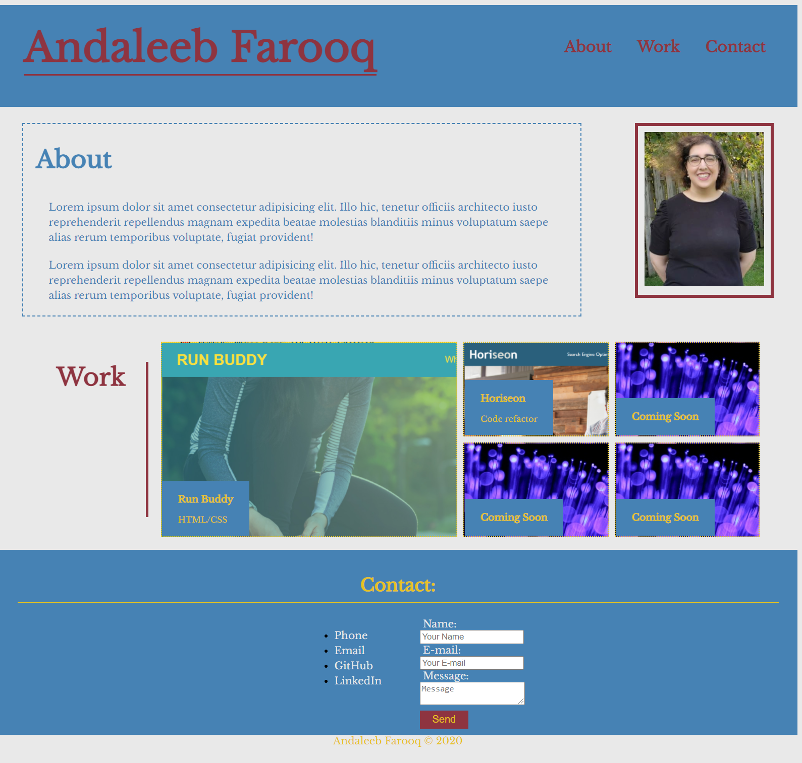

# Portfolio

## Description
A portfolio with deployed works included.

Table of Contents |
-------------------|
[Installation](#Installation)
[Usage](#Usage)
[Technologies](#Technologies)
[Screenshots](#Screenshots)
[Author](#Author)
[Questions](#Questions)

 

## Usage

The project is a basic portfolio created with HTML and CSS. The site includes a short bio, an picture along with a display of deployed works.

You can find the deployed link and the repository link below:

Deployed Link: [Deployed Link](https://cerafinn.github.io/portfolio)

Repo Link: [Repo Link](https://github.com/cerafinn/portfolio)

 

## Technologies

* HTML
* CSS

 

## Screenshot

 

## Author

Created with ❤️ by Andaleeb Farooq

 

## Questions

If you have any questions or issues, feel free to reach out at: andaleeb.farooq@gmail.com.
You can also find more of my work on Github at [github link](https://github.com/cerafinn)