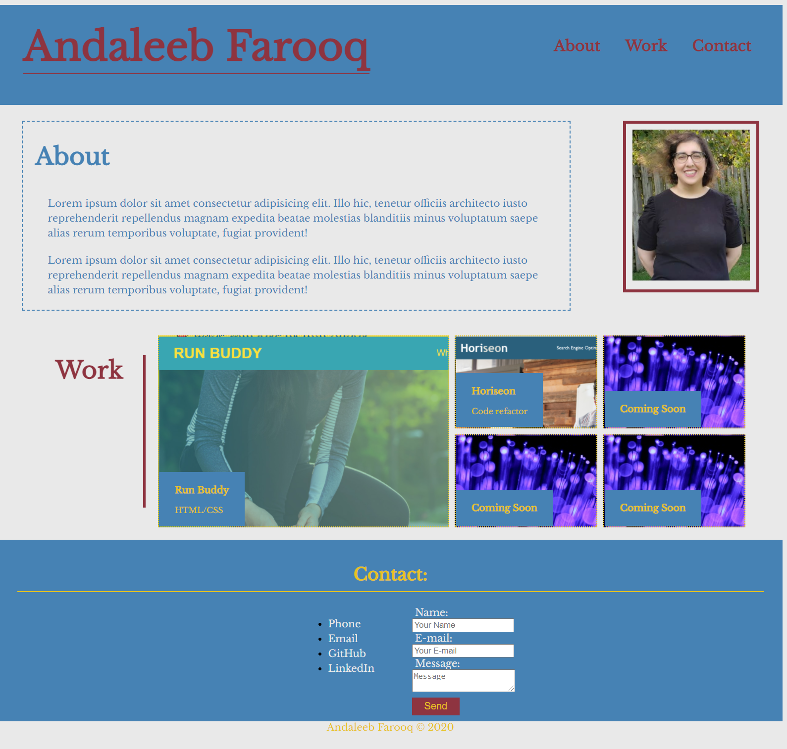

# portfolio

## Description
A portfolio of work completed by the user.

Table of Contents |
-------------------|
[Usage](#Usage)
[Technologies](#Technologies)
[Screenshots](#Screenshots)
[Author](#Author)
[Questions](#Questions)

 

## Usage

A basic portfolio created with HTML and CSS. The site includes a short bio, an picture along with a display of deployed works. The website is mobile responsive. The works section allows for users to click on the image of the work and be taken to the deployed work.

You can find the deployed link and the repository link below:

Deployed Link: [Deployed Link](https://cerafinn.github.io/first-portfolio)

Repo Link: [Repo Link](https://github.com/cerafinn/first-portfolio)

 

## Technologies

* HTML
* CSS
* Mobile Responsive

 

## Screenshots

## Author

Andaleeb Farooq: [:octocat:](https://github.com/cerafinn)

 

## Questions

If you have any questions or issues, feel free to reach out at: andaleeb.farooq@gmail.com.
You can also find more of my work on Github at [github link](https://github.com/cerafinn).
